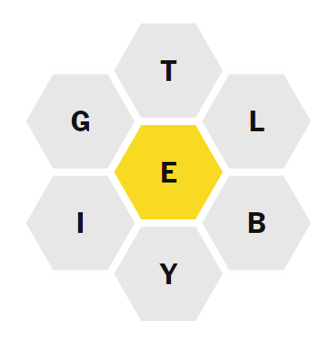

# NYT Spelling Bee Solver

This project is an exploration of different algorithms for solving
the [NYT Spelling Bee](https://www.nytimes.com/puzzles/spelling-bee). It also includes a simple python script you can
use to generate a list of possible correct answers for any puzzle input.

## NYT Spelling Bee Rules

If you are unfamiliar with the NYT Spelling Bee, the basic rules are simple. You need to form as many english words as
possible within the following constraints:

* Words must be formed only from the given 7 letters.
* The "central" letter *must* appear in every word you form.
* You can repeat letters as many times as you want.
* Each word must be at least 4 letters.

A typical puzzle might look like this:



## Algorithm Comparisons

I tried 4 different approaches. Each is explained briefly below and the code for them can be found
in [spelling_bee_solvers.py](spelling_bee_solvers.py).

### Naive Approach

For each word in our dictionary, check if it contains the central letter and check that it doesn't contain any letter
apart from the 7 letters given in the puzzle.

### Bitwise Comparisons

Instead of using python structures like sets and lists for comparing the letters and the words, use bitwise operators
instead. Bitwise operations are generally significantly faster than normal string operations.

In this case, there are three variables: center letter, other letters, word we are checking. Each will be represented by
26 bits, where each bit represents a letter of the english language. An equation can be created by generating a truth
table for these variables and deriving the [Sum of Products](https://en.wikipedia.org/wiki/Canonical_normal_form).

**W** - word we are checking

**C** - center letter that must always be present in the word

**O** - other letters that should be optionally present in the word

**R** - result where we want the value to be 1 if this combination invalidates the word

| W | C | O | R | notes                                                                                          |
|---|---|---|---|------------------------------------------------------------------------------------------------|
| 0 | 0 | 0 | 0 | Letter absent in word, center and others. Word is valid.                                       |
| 0 | 0 | 1 | 0 | Letter present only in others. Word is valid.                                                  |
| 0 | 1 | 0 | 1 | Letter present only in center. Hence, word is not valid                                        |
| 0 | 1 | 1 | 0 | Letter present in center and others. Not possible, so R=0 to reduce the number of terms.       |
| 1 | 0 | 0 | 1 | Letter present in word but not in center or others. Word is invalid.                           |
| 1 | 0 | 1 | 0 | Letter present in word and in others. Word is valid.                                           |
| 1 | 1 | 0 | 0 | Letter present in word and in center. Word is valid.                                           |
| 1 | 1 | 1 | 0 | Letter present in word, center and others. Not possible, so R=0 to reduce the number of terms. |

```
SoP = ((not W) and C and (not O)) OR (W and (not C) and (not O))
    = (~W & C & ~O) | (W & ~C & ~O)
    = ~O & ((~W & C) | (W & ~C))
```

### Prefix Tree / Trie

Generate a [prefix tree](https://en.wikipedia.org/wiki/Trie) from the dictionary of words being used. Explore all paths
of the tree to find all possible words for a given set of letters. For the python implementation, this was represented
using a dictionary where the key is a prefix and the value is the set of all possible letters that can occur after that
prefix.

Sample of prefix tree formed from a dictionary of english words:

```
       r
    /    \
  ro      ra
 /  \       \
rot  rob     rat
```

### Radix Tree

The [radix Tree](https://en.wikipedia.org/wiki/Radix_tree) is a variation of the prefix tree where instead of storing
the whole prefix, a word is generated by successively combining a lead node with its parents all the way up to the root
node. For the python implementation, this was represented using a nested dictionary where the key is a letter and the
value is a dictionary where each key is a letter that can follow the parent.

Sample of radix tree formed from a dictionary of english words:

```
    r
   / \
  o   a
 / \   \
t   b   t
```

This is mostly supposed to be a space optimization, but it turned out to be significantly faster as well.

### Algorithm Benchmarks

For benchmarking, a [large dictionary](data/raw_word_lists/words_alpha.txt) of words was used (370104 unique words).
Each
algorithm was run 10,000 times and the runtime was averaged across these runs. Each run of 10,000 iterations was
repeated 5 times and the lowest value was taken (in line with best practices from the `timeit` library).

Note: any preprocessing steps were not counted in the time taken. Where a preprocessing step is anything that can be
performed once regardless of the puzzle, such as generating the radix tree or prefix tree.

| Algorithm   | Time (s)    | Speedup |
|-------------|-------------|---------|
| Naive       | 0.0556735   | 1.00    |
| Bitwise     | 0.0133129   | 4.18    |
| Prefix Tree | 0.00074135  | 75.10   |
| Radix Tree  | 0.000483715 | 115.10  |

## Note on dictionaries

The NYT doesn't use a standardized dictionary for the spelling bee puzzle, at least not one that they publish. From
previous interviews with the puzzle creator, it seems like they decide the words in a somewhat ad-hoc manner and will
remove words they deem obscure or offensive.

So as part of this project, I also created a custom dictionary of words that I think are most likely to be used. This
dictionary is a combination of "common english words" and past solutions to the NYT spelling bee (that I scraped from a
website). It's still not fully correct and will often generate extra words that the NYT spelling bee doesn't accept. In
rare cases, the NYT spelling bee will accept words that aren't included in my dictionary.

If you want to use this dictionary yourself, you can find the latest dictionary
in [this directory](data/custom).

## Running the solver script

In general, websites like [nytbee.com](https://www.nytbee.com) will have the solution for today's puzzle. But if for
some reason, you want to use the solver from this project, you can run it as follows:

```commandline
python3.12 solve_nyt_bee.py -c c -o aptmhu
```

where `c` is the central character and `o` are the other characters.

Requirements:

* Python 3.12

## Requirements

The solver script doesn't require anything apart from python 3.12. But if you want to use the other files in this
project, you can find the requirements in [requirements.txt](requirements.txt) which you can install using:

```commandline
pip install -r requirements.txt
```